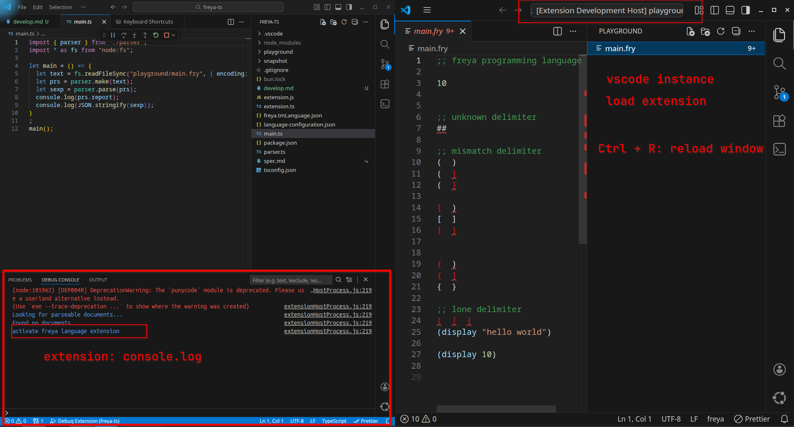

# How to debuging 

# Project 

both [tasks.json](./.vscode/tasks.json) and [launch.json](./.vscode/launch.json) configure the vscode launch setting used for debuging `vscode extension` using vscode. 

- [freya.tmLanguage.json](freya.tmLanguage.json):  define TextMate language grammar for syntax highlighting in vscode 

- [language-configuration.json](language-configuration.json): define vscode basic language support 

- [playground](./playground/): is use for test vscode extension and test cases. 

# vscode offical documentation

WARNING: some documentation might stale, trust your judgement and reproduciable example, find open source project find the actual usage and actual behavior. 

[vscode syntax highlight](https://code.visualstudio.com/api/language-extensions/syntax-highlight-guide)

[vscode language configuration](https://code.visualstudio.com/api/language-extensions/language-configuration-guide)

e.g. We can reference the OCaml and Haskell vscode extension, learn example is better than sucks MicroSoft documentation. 

# vscode command: 
  > `Developer: Inspect Editor Tokens and Scopes` debug TextMate syntax highlighting 
  > `Developer: Reload Window` reload window (in other words: restart vscode instance)  

# develop skill in vscode   
  - selection AST 
    > `Expand Selection`: language support selection 
    > `Shrink Selection`: language support selection
    > `BraSel:SelectInclude`: 

    > `Add Cursor Above`: mutil-cursor operation
    > `Add Cursor Below`: mutil-cursor operation

  - project manage 
    > `Show All Commands`: open command panel 
    > `Go to File...`: 
    > `Go to Next Problem in Files (Error, Warning, Info)`: similar vim,neovim quickfix

# vscode extension

Name: Bracket Select
Id: chunsen.bracket-select
Description: Quick select code between brackets, support for (),{} and [], <>
Version: 2.0.2
Publisher: Chunsen Wang

